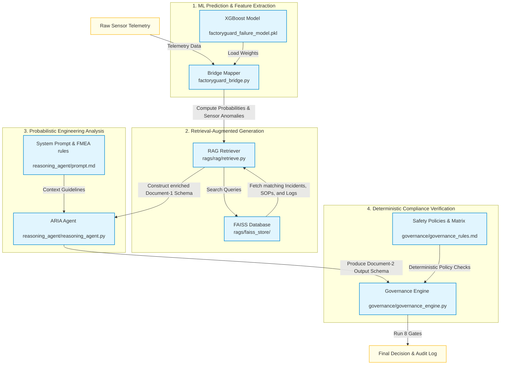
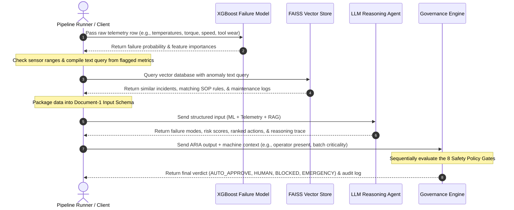

# FactoryGuard AI: Predictive Maintenance & Safety Governance

FactoryGuard is an industrial-grade **Agentic Reliability & Safety Governance System** designed to bridge probabilistic Machine Learning forecasts with deterministic safety policies for CNC machinery. 

The core safety philosophy of FactoryGuard is: **AI performs reasoning, but code performs governance.** This design guarantees that while the AI agent (ARIA) can interpret complex telemetry and suggest actions, the system can never "hallucinate" an unsafe action or execute an unauthorized shutdown without strict deterministic policy compliance.

---

## 1. System Architecture & Flow

The system processes telemetry inputs sequentially across four layers:
1. **Predictive Analytics (XGBoost)**: Predicts raw failure probability and isolates key telemetry features.
2. **Context Enrichment (RAG via FAISS)**: Performs semantic search against historical incidents, SOP guidelines, and maintenance logs.
3. **Agentic Reasoning (ARIA LLM)**: Synthesizes model predictions, raw sensors, and RAG context into an FMEA-aligned diagnosis.
4. **Safety Governance (Deterministic Gates)**: Evaluates recommendations against the 8 safety policy gates.

### Pipeline Flow Diagram


### Sequence Flow


---

## 2. Directory Structure & Component Mapping

```directory
FactoryGuard/
├── ai4i2020.csv              # Synthetic predictive maintenance dataset (10,000 instances)
├── eda.ipynb                 # ML model development (XGBoost failure classifier training)
├── factoryguard_bridge.py    # Bridge between tabular ML outputs and reasoning pipeline input
├── factoryguard_system.py    # Unified system orchestrator coordinating ML, RAG, and Governance
├── test_pipeline.py          # End-to-end execution script simulating multiple safety scenarios
│
├── reasoning_agent/          # ARIA (Agentic Reliability Intelligence Analyst) module
│   ├── reasoning_agent.py    # LLM/NIM wrapper + rule-based mock logic
│   ├── prompt.md             # System prompt containing engineering directives and FMEA heuristics
│   ├── input_schema.json     # Schema defining ML predictions, sensor metrics, and RAG inputs
│   └── output_schema.json    # Schema for the structured failure diagnosis and recommended actions
│
├── governance/               # Safety & compliance policy enforcement module
│   ├── governance_engine.py  # Deterministic evaluation of the 8 policy gates
│   ├── governance_rules.md   # Authoritative business logic and Decision Matrix
│   ├── input_schema.json     # Schema for mapping agent outputs and factory context
│   └── output_schema.json    # Schema for audit logs and final verdicts
│
├── integration/              # LangChain integration layer
│   ├── governance_adapter.py # Adapts diagnosis/action state objects to governance input format
│   ├── governance_node.py    # LangChain node wrapper mapping verdict output to graph state
│   └── test_governance_adapter.py # Adapter integration verification script
│
└── rags/                     # Retrieval-Augmented Generation & Diagnosis
    ├── faiss_store/          # Vector indices for Incidents, SOPs, and Maintenance Logs
    ├── rag/
    │   ├── ingest.py         # Vector ingestion script using nomic-embed-text-v1.5 and FAISS
    │   └── retrieve.py       # Evidence retriever matching sensor anomalies to safety docs
    └── diagnose.py           # Standalone anomaly diagnosis using Groq's Llama-3 model
```

---

## 3. The 8 Policy Gates (Safety Governance)

Every recommended action is passed sequentially through 8 checks:
1. **Safety Gate**: If safety risk is `CRITICAL`, the action *must* be `IMMEDIATE_SHUTDOWN` or `EMERGENCY_STOP`. Otherwise, the verdict is forced to `BLOCKED`.
2. **Confidence Gate**: If overall reasoning confidence $< 0.65$, it forces a downgrade to `HUMAN_APPROVAL_REQUIRED` (AI is not sure enough).
3. **Novel Pattern Gate**: If the agent flags `novel_failure_pattern` (no vector store incident correlation), it downgrades to `HUMAN_APPROVAL_REQUIRED`.
4. **SOP Compliance Gate**: If a mandatory SOP is violated, the action is `BLOCKED`.
5. **Operator Presence Gate**: If an immediate action is required but no operator is present on the floor, it escalates to `SUPERVISOR` approval.
6. **Batch Criticality Gate**: If a `CRITICAL` batch is running and the AI wants to shutdown/stop, it escalates to `PLANT_MANAGER` approval to prevent high financial losses.
7. **Recurrence Gate**: If a machine triggers $> 3$ alerts in a 24-hour window, it overrides all verdicts and escalates to `EMERGENCY_ALERT`.
8. **Timeout Gate**: If a `HUMAN_APPROVAL_REQUIRED` request times out (e.g., operator doesn't respond within 15 mins for immediate actions), it automatically resolves to `AUTO_APPROVE` with a safe, non-destructive fallback action (`REDUCE_LOAD`).

---

## 4. How to Run and Verify the Pipeline

Ensure [uv](https://github.com/astral-sh/uv) is installed for dependency management.

### 4.1. Run the Complete Test Suite
To run all test scenarios (including mock failure, operator absence, confidence gates, batch criticality, overrides, timeouts, and the end-to-end connected orchestrator):
```bash
uv run --with faiss-cpu --with sentence-transformers --with pandas --with joblib --with requests --with einops python test_pipeline.py
```

### 4.2. Run the Unified Orchestrator on Mock Data
To run the connected orchestrator alone:
```bash
uv run --with faiss-cpu --with sentence-transformers --with pandas --with joblib --with requests --with einops python factoryguard_system.py
```

### 4.3. Run the Governance Adapter Test
To test the LangChain node translation layer:
```bash
uv run --with faiss-cpu --with sentence-transformers --with pandas --with joblib --with requests --with einops python integration/test_governance_adapter.py
```
